# **SpringCloud**

# 一、微服务架构理论

1. **什么是微服务**

   ```
   简单举例：看军事新闻的同学应该都知道，一艘航空母舰作战能力虽然很强，但是弱点太明显，就是防御能力太差，单艘的航空母舰很少单独行动，通常航空母舰战斗群才是主要军事力量，你可以把单艘航母理解为的单体应用（防御差，机动性不好），把航母战斗群（调度复杂，维护费用高）理解为微服务。
   ```

   

   

   

2. **SpringCloud介绍**

   

   

# 二、版本选择


更加详细的版本对应：

**https://start.spring.io/actuator/info**


可以在springcloud官网查看最新的版本，推荐选用哪一个版本的springboot

# 三、Cloud个组件的停更/升级/替换


# 四、微服务架构编码构建

搭建一个简单的增删改查的Springboot项目，方便后面springcloud的学习

## 1、构建父模块


```xml
 <properties>
    <project.build.sourceEncoding>UTF-8</project.build.sourceEncoding>
    <maven.compiler.source>12</maven.compiler.source>
    <maven.compiler.target>12</maven.compiler.target>
    <junit.version>4.12</junit.version>
    <lombok.version>1.18.10</lombok.version>
    <log4j.version>1.2.17</log4j.version>
    <mysql.version>8.0.17</mysql.version>
    <druid.version>1.1.9</druid.version>
    <mybatis.spring.boot.version>2.1.1</mybatis.spring.boot.version>
  </properties>

  <!-- 子模块继承之后，提供作用：锁定版本+子modlue不用写groupId和version  -->
  <dependencyManagement>
    <dependencies>
      <!--spring boot 2.2.2-->
      <dependency>
        <groupId>org.springframework.boot</groupId>
        <artifactId>spring-boot-dependencies</artifactId>
        <version>2.2.2.RELEASE</version>
        <type>pom</type>
        <scope>import</scope>
      </dependency>
      <!--spring cloud Hoxton.SR1-->
      <dependency>
        <groupId>org.springframework.cloud</groupId>
        <artifactId>spring-cloud-dependencies</artifactId>
        <version>Hoxton.SR1</version>
        <type>pom</type>
        <scope>import</scope>
      </dependency>
      <!--spring cloud alibaba 2.1.0.RELEASE-->
      <dependency>
        <groupId>com.alibaba.cloud</groupId>
        <artifactId>spring-cloud-alibaba-dependencies</artifactId>
        <version>2.1.0.RELEASE</version>
        <type>pom</type>
        <scope>import</scope>
      </dependency>

      <dependency>
        <groupId>mysql</groupId>
        <artifactId>mysql-connector-java</artifactId>
        <version>${mysql.version}</version>
      </dependency>
      <dependency>
        <groupId>com.alibaba</groupId>
        <artifactId>druid</artifactId>
        <version>${druid.version}</version>
      </dependency>
      <dependency>
        <groupId>org.mybatis.spring.boot</groupId>
        <artifactId>mybatis-spring-boot-starter</artifactId>
        <version>${mybatis.spring.boot.version}</version>
      </dependency>
      <dependency>
        <groupId>junit</groupId>
        <artifactId>junit</artifactId>
        <version>${junit.version}</version>
      </dependency>
      <dependency>
        <groupId>log4j</groupId>
        <artifactId>log4j</artifactId>
        <version>${log4j.version}</version>
      </dependency>
      <dependency>
        <groupId>org.projectlombok</groupId>
        <artifactId>lombok</artifactId>
        <version>${lombok.version}</version>
        <optional>true</optional>
      </dependency>
    </dependencies>
  </dependencyManagement>
```

## 2、构建微服务子模块（支付模块）

- **创建modle**

- **配置pom文件**

  ```xml
  <dependencies>
          <!-- https://mvnrepository.com/artifact/org.springframework.boot/spring-boot-starter-web -->
          <dependency>
              <groupId>org.springframework.boot</groupId>
              <artifactId>spring-boot-starter-web</artifactId>
          </dependency>
  
          <!-- https://mvnrepository.com/artifact/org.springframework.boot/spring-boot-starter-web -->
          <dependency>
              <groupId>org.springframework.boot</groupId>
              <artifactId>spring-boot-starter-actuator</artifactId>
          </dependency>
  
          <!-- https://mvnrepository.com/artifact/org.springframework.boot/spring-boot-starter-web -->
          <dependency>
              <groupId>org.mybatis.spring.boot</groupId>
              <artifactId>mybatis-spring-boot-starter</artifactId>
          </dependency>
  
          <!-- https://mvnrepository.com/artifact/com.alibaba/druid -->
          <dependency>
              <groupId>com.alibaba</groupId>
              <artifactId>druid-spring-boot-starter</artifactId>
              <version>1.1.10</version>
          </dependency>
          <!-- https://mvnrepository.com/artifact/mysql/mysql-connector-java -->
          <dependency>
              <groupId>mysql</groupId>
              <artifactId>mysql-connector-java</artifactId>
          </dependency>
  
          <!-- https://mvnrepository.com/artifact/org.springframework.boot/spring-boot-starter-jdbc -->
          <dependency>
              <groupId>org.springframework.boot</groupId>
              <artifactId>spring-boot-starter-jdbc</artifactId>
          </dependency>
  
          <!-- https://mvnrepository.com/artifact/org.springframework.boot/spring-boot-devtools -->
          <dependency>
              <groupId>org.springframework.boot</groupId>
              <artifactId>spring-boot-devtools</artifactId>
              <scope>runtime</scope>
              <optional>true</optional>
          </dependency>
  
          <!-- https://mvnrepository.com/artifact/org.projectlombok/lombok -->
          <dependency>
              <groupId>org.projectlombok</groupId>
              <artifactId>lombok</artifactId>
              <optional>true</optional>
          </dependency>
  
          <!-- https://mvnrepository.com/artifact/org.springframework.boot/spring-boot-starter-test -->
          <dependency>
              <groupId>org.springframework.boot</groupId>
              <artifactId>spring-boot-starter-test</artifactId>
              <scope>test</scope>
          </dependency>
  
      </dependencies>
  <build>
      <plugins>
          <plugin>
              <groupId>org.apache.maven.plugins</groupId>
              <artifactId>maven-compiler-plugin</artifactId>
              <version>3.1</version>
              <configuration>
                  <source>1.8</source>
                  <target>1.8</target>
              </configuration>
          </plugin>
      </plugins>
  </build>
  ```

  【子项目的pom文件里面的依赖可以不用写版本号，会自动去继承父模块的依赖版本号】

- 配置配置文件properties

  ```properties
  server.port=8001
  spring.application.name=cloud-payment-service
  spring.datasource.driver-class-name=com.mysql.cj.jdbc.Driver
  spring.datasource.password=123456
  spring.datasource.username=root
  spring.datasource.url=jdbc:mysql://192.168.174.131:33306/springcloud?useUnicode=true&characterEncoding=utf8&serverTimezone=GMT%2B8&useSSL=false
  mybatis.type-aliases-package=com.zyq.pojo
  mybatis.mapper-locations=classpath:mapper/*Mapper.xml
  
  ```

- **创建表**

  

- **Mapper层**

  ```java
  @Mapper
  public interface PaymentMapper {
  
      public int create(Payment payment);
  
      public Payment getPaymentById(@Param("id") Long id);
  }
  ```

- **Service层**

  ```java
  public interface PaymentService {
      public int create(Payment payment);
      public Payment getPaymentById(Long id);
  }
  ```

  ```java
  @Service
  public class PaymentServiceImpl implements PaymentService {
      @Resource
      PaymentMapper mapper;
      @Override
      public int create(Payment payment) {
          return mapper.create(payment);
      }
      @Override
      public Payment getPaymentById(Long id) {
          return mapper.getPaymentById(id);
      }
  }
  ```

- **controller**

  ```java
  @RestController
  @Slf4j
  public class PaymentController {
      @Resource
      PaymentService service;
  
      @PostMapping("/create")
      public CommonResult create(Payment payment) {
          int result = service.create(payment);
          log.info("*****插入结果：" + result);
          if (result > 0) {  //成功
              return new CommonResult(200, "插入数据库成功", result);
          } else {
              return new CommonResult(444, "插入数据库失败", null);
          }
  
      }
      @GetMapping("/getpayment")
      public CommonResult getOne(@RequestParam long id) {
          Payment payment = service.getPaymentById(id);
          log.info("*****查询结果：" + payment);
          if (payment != null) {  //说明有数据，能查询成功
              return new CommonResult(200, "查询成功", payment);
          } else {
              return new CommonResult(444, "没有对应记录，查询ID：" + id, null);
          }
      }
  }
  ```

- **实体类**

  ```java
  @Data
  @AllArgsConstructor
  @NoArgsConstructor
  public class Payment implements Serializable {
      private Long id;
      private String serial;
  
      @Override
      public String toString() {
          return "Payment{" +
                  "id=" + id +
                  ", serial='" + serial + '\'' +
                  '}';
      }
  }
  ```

  ```java
  @Data
  @AllArgsConstructor
  @NoArgsConstructor
  public class CommonResult<T> {
      private Integer code;
      private String message;
      private T data;
  
      public CommonResult(Integer code, String message) {
          this.code = code;
          this.message = message;
          this.data=null;
      }
  }
  ```

## 3、订单模块

- **和支付模块步骤相同**

  创建module>>pom>>properties>>controller

  因为订单模块只需要将请求发送给支付模块即可，所以只需要有controller层

- **使用RestTemplate调用支付的微服务模块**

  ```java
  @Configuration
  public class ApplicationContextConfig {
      @Bean
      public RestTemplate getRestTemplate(){
          return new RestTemplate();
      }
  }
  ```

- **controller**

  ```java
  @RestController
  @Slf4j
  public class OrderController {
      public static final String PAYMENT_URL = "http://localhost:8001";
      @Resource
      private RestTemplate restTemplate;
  
      @GetMapping("/consumer/payment/create")
      public CommonResult<Payment> create(@RequestBody Payment payment) {
          CommonResult commonResult = restTemplate.postForObject(PAYMENT_URL + "/create", payment, CommonResult.class);
          return commonResult;
      }
  
      @GetMapping("/consumer/payment/getpayment")
      public CommonResult<Payment> getPayment(@RequestParam long id) {
          return restTemplate.getForObject(PAYMENT_URL + "/getpayment/?id="+id, CommonResult.class);
      }
  }
  
  ```

- **结果访问订单此模块就可以调用到令一个模块的功能**

  

## 4、热部署

- 在子模块加入依赖

```xml
<dependency>
    <groupId>org.springframework.boot</groupId>
    <artifactId>spring-boot-devtools</artifactId>
   <scope>runtime</scope>
    <optional>true</optional>
</dependency>
```

- 在父模块加入插件

  ```xml
              <plugin>
                  <groupId>org.springframework.boot</groupId>
                  <artifactId>spring-boot-maven-plugin</artifactId>
                  <configuration>
                      <fork>true</fork>
                      <addResources>true</addResources>
                  </configuration>
              </plugin> 
  ```

- 修改配置

  

- alt+ctrl+shift+/

  

## 5、工程重构

- 原因：此时两个微服务模块都含有相同的代码，例如pojo；需要把它提出来。

- 新建立一个module，存放公共的类或者工具类

  

- 把需要公用的代码存放在改模块下

- 打包 clean >> install，放入本地仓库

  

- 在其他模块中引入该模块依赖，并且删除原有pojo包，替换成功

  ```xml
  <dependency>
      <groupId>com.zyq</groupId>
      <artifactId>springcloud-api-commons</artifactId>
      <version>${project.version}</version>
  </dependency>
  ```

# 五、 Eureka服务注册与发现

从本章起正式进入SpringCloud技术学习，会将SpringCloud的技术一个个往前面搭起模块加


## 1、Eureka基础知识


## 2、单机Eureka构建

- **新建module > springcloud-eureka-server7001**

- **写pom**

  ```xml
  <dependencies>
          <!--eureka server-->
          <dependency>
              <groupId>org.springframework.cloud</groupId>
              <artifactId>spring-cloud-starter-netflix-eureka-server</artifactId>
          </dependency>
  
          <dependency>
              <groupId>com.zyq</groupId>
              <artifactId>springcloud-api-commons</artifactId>
              <version>${project.version}</version>
          </dependency>
  
          <!-- https://mvnrepository.com/artifact/org.springframework.boot/spring-boot-starter-web -->
          <dependency>
              <groupId>org.springframework.boot</groupId>
              <artifactId>spring-boot-starter-web</artifactId>
          </dependency>
  
          <!-- https://mvnrepository.com/artifact/org.springframework.boot/spring-boot-starter-web  -->
          <dependency>
              <groupId>org.springframework.boot</groupId>
              <artifactId>spring-boot-starter-actuator</artifactId>
          </dependency>
  
          <!-- https://mvnrepository.com/artifact/org.springframework.boot/spring-boot-devtools -->
          <dependency>
              <groupId>org.springframework.boot</groupId>
              <artifactId>spring-boot-devtools</artifactId>
              <scope>runtime</scope>
              <optional>true</optional>
          </dependency>
  
          <!-- https://mvnrepository.com/artifact/org.projectlombok/lombok -->
          <dependency>
              <groupId>org.projectlombok</groupId>
              <artifactId>lombok</artifactId>
          </dependency>
  
          <!-- https://mvnrepository.com/artifact/org.springframework.boot/spring-boot-starter-test -->
          <dependency>
              <groupId>org.springframework.boot</groupId>
              <artifactId>spring-boot-starter-test</artifactId>
              <scope>test</scope>
          </dependency>
          <dependency>
              <groupId>junit</groupId>
              <artifactId>junit</artifactId>
          </dependency>
          <dependency>
              <groupId>org.springframework.boot</groupId>
              <artifactId>spring-boot-autoconfigure</artifactId>
          </dependency>
  
      </dependencies>
  ```

- **写配置文件properties**

  ```properties
  server.port=7001
  #eureka服务端的实例名称
  eureka.instance.hostname=localhost
  #不像注册中心注册自己
  eureka.client.register-with-eureka=false
  #表示自己就是注册中心，职责是维护服务实例，并不需要去检索服务
  eureka.client.fetch-registry=false
  #设置与eureka server交互的地址查询服务和注册服务都需要依赖这个地址
  eureka.client.service-url.defaultZone=http://${eureka.instance.hostname}:${server.port}/eureka/
  ```

- **主启动类**

  ```java
  @SpringBootApplication
  @EnableEurekaServer
  public class SpringcloudEurekaServer7001Application {
  
      public static void main(String[] args) {
          SpringApplication.run(SpringcloudEurekaServer7001Application.class, args);
      }
  }
  ```

- **测试**

  ```
  访问http://localhost:7001/
  ```

  

  能访问 贼说明成功

- **将8001支付服务注册进Eureka**

  1. 修改pom

     ```xml
              <dependency>
                 <groupId>org.springframework.cloud</groupId>
                 <artifactId>spring-cloud-starter-netflix-eureka-client</artifactId>
             </dependency>
     ```

  2. 修改properties

     ```properties
     #表示是否将自己注册进EurekaServer
     eureka.client.register-with-eureka=true
     #是否从EurekaServer抓取自己的注册信息，集群必须设true，才能配置ribbon使用负载均衡
     eureka.client.fetch-registry=true
     eureka.client.service-url.defaultZone=http://localhost:7001/eureka
     ```

  3. 给主启动类添加注解

     ```java
     @EnableEurekaClient
     ```

  4. 测试先启动7001，再启动8001

     

- **同样的80也是一个微服务也需要将80订单服务也注册进Eureka**

  

## 3、集群Eureka构建


- **集群原理**

  注册中心和服务提供者service Provider都需要集群

  解决办法：搭建Eureka注册中心集群，实现负载均衡+故障容错

  

- **集群搭建步骤**

  1. 新建一个springcloud-eureka-server7002

  2. 同样的pom（和7001相同）

  3. 为了方便好看两台机器，把localhost映射为两个地址

     

  4. 修改properties文件，改成集群模式，相互注册

     7001：properties

     ```properties
     server.port=7001
     #eureka服务端的实例名称  自己使用localhost 此处使用集群 相互注册
     eureka.instance.hostname=eureka7001.com
     #不像注册中心注册自己
     eureka.client.register-with-eureka=false
     #表示自己就是注册中心，职责是维护服务实例，并不需要去检索服务
     eureka.client.fetch-registry=false
     #设置与eureka server交互的地址查询服务和注册服务都需要依赖这个地址
     eureka.client.service-url.defaultZone=http://eureka7002.com:7002/eureka/
     ```

     7002：properties

     ```properties
     server.port=7002
     #eureka服务端的实例名称  自己使用localhost 此处使用集群 相互注册
     eureka.instance.hostname=eureka7002.com
     #不像注册中心注册自己
     eureka.client.register-with-eureka=false
     #表示自己就是注册中心，职责是维护服务实例，并不需要去检索服务
     eureka.client.fetch-registry=false
     #设置与eureka server交互的地址查询服务和注册服务都需要依赖这个地址
     eureka.client.service-url.defaultZone=http://eureka7001.com:7001/eureka/
     ```

  5. 主启动类都打上：@EnableEurekaServer

  6. 结果

     

- **将支付微服务8001和订单微服务80，注册进集群**

  只需要修改两个模块的properties文件：

  ```properties
  #集群版本
  eureka.client.service-url.defaultZone=http://eureka7001.com:7001/eureka,http://eureka7002.com:7002/eureka
  ```

  依次启动7001，7002两个注册中心，在启动8001和80微服务

  结果：两个微服务都被注册进了集群

  

- **服务提供者集群搭建（Service Provider）**

  1. 新建springcloud-provider-payment8002

  2. pom和8001相同

  3. properties和8001相同，注意修改端口

  4. 主启动类

  5. 修改controller，加入自己的端口，方便查看

     

  6. 结果

     

- **负载均衡**

  目的：使得订单微服务从80端口访问，只认注册中心的服务名称；然后由注册中心去调用不同的微服务；

  1. 修改80的controller

     

     

  2. 开启RestTemplate负载均衡能力（Ribbon）

     

  3. 结果：8001 8002交替出现；Ribbon和Eureka整合后消费者可以直接调用服务而不用再关心地址和端口号，且该服务还有负载功能了

  4. 

## 4、actuator微服务信息完善

命名规范


- **主机名修改：修改springcloud-payment8001**

  ```properties
  eureka.instance.instance-id=payment8001
  ```

- **显示访问路径IP**

  ```properties
  eureka.instance.prefer-ip-address=true
  ```

## 5、服务发现Discovery

​	对于注册进eureka里面的微服务，可以通过服务发现来获得该服务的信息

- **可以使用这个对象**

  ```java
  @Resource
  private DiscoveryClient discoveryClient;
  ```

- **可以获取在注册中心注册过的服务的一些信息**

  ```java
  
  @GetMapping(value = "/payment/discovery")
  public Object discovery(){
      List<String> services = discoveryClient.getServices();
      for (String element : services) {
          log.info("***** element:"+element);
      }
      List<ServiceInstance> instances = discoveryClient.getInstances("CLOUD-PAYMENT-SERVICE");
      for (ServiceInstance instance : instances) {
          log.info(instance.getServiceId()+"\t"+instance.getHost()+"\t"+instance.getPort()+"\t"+instance.getUri());
      }
      return this.discoveryClient;
  }
  ```

- **在主启动类增加注解**

  ```java
  @EnableDiscoveryClient
  ```

## 6、Eureka自我保护

相当疫情期间这个企业暂时不能来交物业不能来上班，物业科技园不会马上把这家企业剔除，还会缓缓。


- **导致原因**：一句话：某时刻某一个微服务不可用了，Eureka不会立刻清理，依旧会对该微服务的信息进行保存

  

  

  例如：


- **禁用自我保护，服务心跳停止马上剔除**

  

# 六、Zookeeper服务注册与发现

## 1、安装zookeeper

- 此处我使用Docker安装

  ```
  docker run --privileged=true -d --name zookeeper --publish 2181:2181  -d zookeeper:latest
  ```

- 关闭防火墙

  ```
  systemctl stop firewalld
  ```

- 可以查看下启动情况

  ```
  docker exec -it zookeeper bash
  ```

- 启动客户端查看

  ```
  ./zkCli.sh -server 192.168.174.131:2181
  ```

## 2、新建服务提供者springcloud-payment8004

- pom

  ```xml
   <dependencies>
  
          <dependency>
              <groupId>com.atguigu.springcloud</groupId>
              <artifactId>cloud-api-commons</artifactId>
              <version>${project.version}</version>
          </dependency>
  
  
          <!-- https://mvnrepository.com/artifact/org.springframework.boot/spring-boot-starter-web -->
          <dependency>
              <groupId>org.springframework.boot</groupId>
              <artifactId>spring-boot-starter-web</artifactId>
          </dependency>
  
          <!-- https://mvnrepository.com/artifact/org.springframework.boot/spring-boot-starter-web -->
          <dependency>
              <groupId>org.springframework.boot</groupId>
              <artifactId>spring-boot-starter-actuator</artifactId>
          </dependency>
  
          <!-- https://mvnrepository.com/artifact/org.springframework.cloud/spring-cloud-starter-zookeeper-discovery -->
          <dependency>
              <groupId>org.springframework.cloud</groupId>
              <artifactId>spring-cloud-starter-zookeeper-discovery</artifactId>
          </dependency>
  
          <!-- https://mvnrepository.com/artifact/org.springframework.boot/spring-boot-devtools -->
          <dependency>
              <groupId>org.springframework.boot</groupId>
              <artifactId>spring-boot-devtools</artifactId>
              <scope>runtime</scope>
              <optional>true</optional>
          </dependency>
  
          <!-- https://mvnrepository.com/artifact/org.projectlombok/lombok -->
          <dependency>
              <groupId>org.projectlombok</groupId>
              <artifactId>lombok</artifactId>
              <optional>true</optional>
          </dependency>
  
          <!-- https://mvnrepository.com/artifact/org.springframework.boot/spring-boot-starter-test -->
          <dependency>
              <groupId>org.springframework.boot</groupId>
              <artifactId>spring-boot-starter-test</artifactId>
              <scope>test</scope>
          </dependency>
      </dependencies>
  
  ```

- properties

  ```properties
  server.port=8004
  spring.application.name=springcloud-payment
  spring.cloud.zookeeper.connect-string=192.168.174.131:2181
  ```

- 主启动类需要注解

  ```java
  @EnableDiscoveryClient
  //该注解用于向使用consul或者zookeeper作为注册中心的注册服务
  ```

- controller：方便测试

  ```java
  @RestController
  @Slf4j
  public class PaymentController {
      @Value("${server.port}")
      private String serverPort;
  
      @GetMapping(value = "/payment/zk")
      public String paymentzk(){
          return "springcloud with zookeeper:"+serverPort+"\t"+ UUID.randomUUID().toString();
      }
  }
  ```

- 启动8004微服务：无报错，再查看zookeeper，发现服务以及被注册进zookeeper

  

## 3、新建服务消费者springcloud-zk-order80

- pom与8004相同

- properties

  ```properties
  server.port=81
  spring.application.name=springcloud-zk-order
  spring.cloud.zookeeper.connect-string=192.168.174.131:2181
  ```

- 主启动：@EnableDiscoveryClient

- controller

  ```java
  @Controller
  @Slf4j
  public class OrderZKController {
      public static final String INVOKE_URL="http://springcloud-payment";
      @Resource
      private RestTemplate restTemplate;
      @GetMapping("/consumer/payment/zk")
      public String payment (){
          return restTemplate.getForObject(INVOKE_URL+"/payment/zk",String.class);
      }
  }
  ```

- 测试：

  zookeeper注册到了两个服务

  通过http://localhost/consumer/payment/zk   80可以通过注册中心访问到8004

# 七、Consul服务注册与发现

## 1、Consul介绍

- 是什么 https://www.consul.io/intro/index.html

  

- 能干嘛

  

- 怎么玩

  https://www.springcloud.cc/spring-cloud-consul.html

## 2、安装运行

- 此处使用docker安装

  ```shell
  docker run -d -p 8500:8500 --restart=always --name=consul consul:latest agent -dev -bootstrap -ui -node=1 -client='0.0.0.0'
  ```

- 可以访问

  

## 3、服务提供者

- 新建微服务springcloud-payment8006

- pom

  ```xml
           <dependency>
              <groupId>org.springframework.cloud</groupId>
              <artifactId>spring-cloud-starter-consul-discovery</artifactId>
          </dependency>
  ```

- properties

  ```properties
  server.port=8006
  spring.application.name=springcloud-payment
  spring.cloud.consul.host=192.168.174.131
  spring.cloud.consul.port=8500
  spring.cloud.consul.discovery.service-name=${spring.application.name}
  
  ```

- 主启动

  ```java
  @EnableDiscoveryClient
  @SpringBootApplication
  ```

- controller

- 运行微服务后再consul中会成功注册，并且能自己访问

  

## 4、服务调用者

- 新建spirngcloud-consul-order80

- pom与8006相同

- properties除了端口和name其他和8006相同

- 主启动相同

- controller

  ```java
  @RestController
  @Slf4j
  public class OrderConsulController {
  
      public static final String INVOME_URL = "http://springcloud-payment";
      @Resource
      private RestTemplate restTemplate;
  
      @GetMapping("/consumer/payment/consul")
      public String payment (){
        String result = restTemplate.getForObject(INVOME_URL+"/payment/consul",String.class);
        return result;
      }
  }
   
  ```

- 测试

  

# 七-1、三个注册中心的异同点


#  八、Ribbon负载均衡服务调用

**Rinbbon需要配合RestTemplate的@LoadBalanced注解使用**

## 1、是什么


## 2、能干嘛


一句话：负载均衡+RestTemplate调用

## 3、Ribbon负载均衡演示


总结：Ribbon其实就是一个软负载均衡的客户端组件，他可以和其他所需请求的客户端结合使用，和eureka结合只是其中的一个实例。

- **RestTemplate**

  get

  post

## 4、Ribbon核心组件IRule


- **替换默认的Ribbon负载均衡规则**

  【注意】：

  

  在新建包下创建MyRule类

  ```java
  @Configuration
  public class MySelfRule {
  
      @Bean
      public IRule myRule(){
          return new RandomRule();//定义为随机
      }
  }
  ```

  在主启动类上添加注解

  ```java
  @RibbonClient(name = "SPRINGCLOUD-PAYMENT-SERVICE",configuration = MySelfRibbonRule.class)
  ```

## 5、Ribbon负载均衡算法

- **原理**

  

- **源码**

- **手写负载均衡算法**

  1. 关闭RestTemplate的@LoadBalanced注解

  2. 在8001/8002 controller增加新方法，方便测试

     ```java
     @GetMapping(value = "/payment/lb")
     public String getPaymentLB(){
         return serverPort;
     }
     ```

  3. 写loadbalancer接口

     ```java
     public interface LoadBalancer {
         //接口作用：传入当前的注册中心有相同名字的多个微服务集合，调用实现类，最后返回轮询后此次调用哪个
         ServiceInstance INSTANCE(List<ServiceInstance> serviceInstances);
     }
     ```

  4. 写实现类

     ```java
     @Component
     public class LoadBalancerImpl implements LoadBalancer {
         private AtomicInteger atomicInteger=new AtomicInteger(0);
     
         @Override
         public ServiceInstance INSTANCE(List<ServiceInstance> serviceInstances) {
             //使用当前访问是第几次 % 当前这个服务名下对应实际微服务数 的余数来确定此次访问哪个微服务实现负载均衡
             int index = getAndIncrement() % serviceInstances.size();
             return serviceInstances.get(index);
         }
     
         public final int getAndIncrement(){
             int current;
             int next;
             while (true){
                 current = this.atomicInteger.get();
                 next=current>=2147483647? 0 :current+1;
                 //下面使用CAS自旋锁，防止多线程情况下，current当前次数不一致的情况
                 //就是在改变的那一时刻在去比较current和期望的相同不，没有被其他线程改变过，确认相同才把next的新值赋给current
                 if (this.atomicInteger.compareAndSet(current,next)){
                     System.out.println("~~~~~~~~ next:"+next);
                     return next;
                 }
             }
         }
     }
     ```

  5. 最后完成80的controller 

     ```java
     
         @GetMapping("/consumer/payment/lb")
         public String getPaymentLB(){
             //获取对应微服务名所以对应的微服务实例集合
             List<ServiceInstance> instances = discoveryClient.getInstances("SPRINGCLOUD-PAYMENT-SERVICE");
             if (instances==null || instances.size()<0){
                 return null;
             }
             //丢入方法，返回应该调用哪个
             ServiceInstance instance = loadBalancer.INSTANCE(instances);
             //获取URI ，去调用
             URI uri = instance.getUri();
             return restTemplate.getForObject(uri+"/payment/lb",String.class);
         }
     ```

  6. 结果：自己的负载均衡成功，两个微服务交替调用

     

# 九、OpenFeign服务接口调用

## 1、概述

- **OpenFeign是什么**

  Feign是一个声明式的web服务客户端，让编写web服务客户端变得非常容易，只需创建一个接口并在接口上添加注解即可

  

- **能干嘛**

  

- **OpenFeign和Feign的区别**

  

## 2、OpenFeign的使用步骤

注解+接口 【自带负载均衡】

- **新建spring-feign-order80模块**

- **pom**

  ```xml
          <dependency>
              <groupId>org.springframework.cloud</groupId>
              <artifactId>spring-cloud-starter-openfeign</artifactId>
          </dependency>
  ```

- **properties**

  ```properties
  server.port=81
  eureka.client.register-with-eureka=false
  eureka.client.service-url.defaultZone=http://eureka7001.com:7001/eureka,http://eureka7002.com:7002/eureka
  ```

- **主启动**

  ```java
  @EnableFeignClients
  ```

- **业务类**

  service:

  ```java
  @Component
  @FeignClient("SPRINGCLOUD-PAYMENT-SERVICE")//注册中心里面的某个微服务
  public interface PaymentFeignService {
      @GetMapping("/getpayment")//去调用目标微服务其中的方法
       CommonResult getOne(@RequestParam long id);
  }
  ```

  controller

  ```java
  @RestController
  @Slf4j
  public class PaymentFeignController {
      @Resource
      PaymentFeignService service;
      @GetMapping("/consumer/payment/get/feign")
      public CommonResult<Payment> getPayment(@RequestParam("id") long id){ //直接去调用接口
          CommonResult one = service.getOne(id);
          return one;
      }
  }
  ```

- **测试，启动7001、7002、8001、8002、80**

  

   

- **小总结**

  

## 3、OpenFeign的超时控制

- **现象**

  在8001、8002创建一个新方法用于测试，**模拟服务提供者需要有3秒钟时间执行才能返回**；但是**服务调用者OpenFeign默认只等待1秒钟**

  8001\8002

  ```java
  @GetMapping("/getString")
      public String getServerString(){
          try {
              TimeUnit.SECONDS.sleep(3);
          } catch (InterruptedException e) {
              e.printStackTrace();
          }finally {
              return "success!!!!!";
          }
      }
  ```

  使用OpenFeign调用报错：Read timed out

  

- **解决：延长OpenFeign的时间**

  

  

## 4、OpenFeign日志打印

- **是什么**

  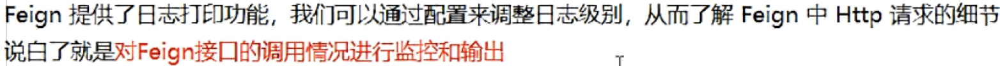

- **日志级别**

  

- **开启日志，配置类**

  ```java
  @Configuration
  public class FeignConfig {
      @Bean
      Logger.Level feignLogger(){
          return Logger.Level.FULL;
      }
  }
  
  ```

- **properties**

  ```properties
  #OpenFeign日志
  #feign日志以什么级别监控什么接口
  logging.level.com.zyq.service.PaymentFeignService=debug
  ```

     

# 十、Hystrix断路器

## 1、概述

- **分布式系统面临的问题**

  

  

  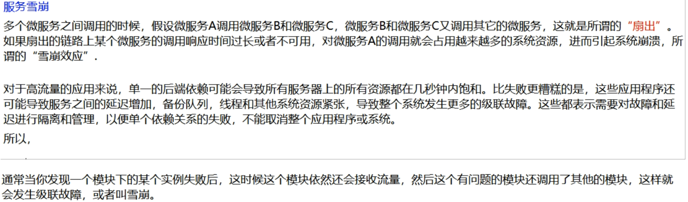

- **是什么**

  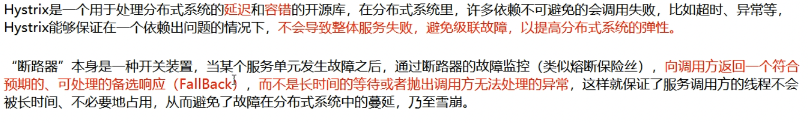

- **能干嘛**

  **服务降级、服务熔断、接近实时的监控**

- **官网资料**

  [官网资料](https://github.com/Netflix/Hystrix/wiki/How-To-Use)

- Hystrix官宣停更

## 2、Hystrix重要的概念

- **服务降级**

  出现故障之后不直接跳出错误，返回一个友好提示，fallback；

  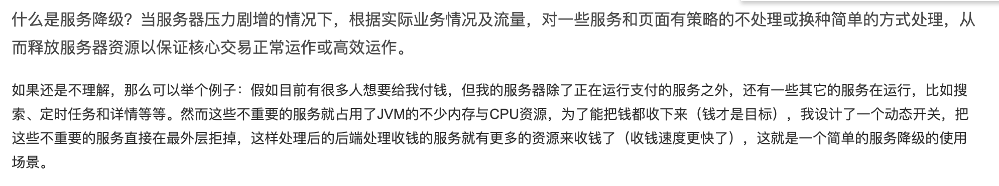

  

- **服务熔断**

  

  **服务熔断的作用类似于我们家用的保险丝，当某服务出现不可用或响应超时的情况时，为了防止整个系统出现雪崩，暂时停止对该服务的调用。**

  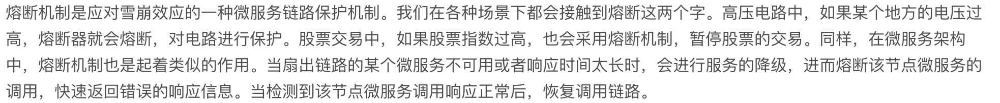

  【**服务降级和服务熔断区别**】

  

- **服务限流**

  

  

## 3、Hystrix案例

- **构建hystrix案例环境**

  1. 新建springcloud-hystrix-payment8001

  2. pom

     ```xml
     <dependency>
        <groupId>org.springframework.cloud</groupId>
        <artifactId>spring-cloud-starter-netflix-hystrix</artifactId>
     </dependency>
     ```

     

  3. properties

     ```properties
     server.port=8001
     spring.application.name=springcloud-hystrix-payment
     
     #表示是否将自己注册进EurekaServer
     eureka.client.register-with-eureka=true
     #是否从EurekaServer抓取自己的注册信息，集群必须设true，才能配置ribbon使用负载均衡
     eureka.client.fetch-registry=true
     #单机版
     #eureka.client.service-url.defaultZone=http://localhost:7001/eureka
     #集群版本
     eureka.client.service-url.defaultZone=http://eureka7001.com:7001/eureka,http://eureka7002.com:7002/eureka
     ```

  4. 主启动：需要使用eureka所以要加上——@EnableEurekaClient

  5. service需要两个方法：一个正常，一个模拟超时3秒（此模块就不要service接口了，节约时间）

     ```java
     @Service
     public class PaymentService {
         public String paymentinfo_OK(Integer id){
             return "线程池：  "+Thread.currentThread().getName()+"  payment_OKID:  "+id+"\t"+"哈哈哈😂";
         }
         public String paymentinfo_timeOut(Integer id){
             int time=3;
             try {
                 TimeUnit.SECONDS.sleep(time);
             } catch (InterruptedException e) {
                 e.printStackTrace();
             }
             return "线程池：  "+Thread.currentThread().getName()+"  timeOut_ID:  "+id+"\t"+"呜呜呜😭,耗时： "+time;
         }
     }
     ```

  6. Controller:调用service

  7. 测试：两个方法都很正常，可以正常调用

  8. 以上述为根基：从正确->错误->降级熔断->恢复

     

- **高并发测试**

  上述在非高并发情况下，可以勉强工作；

  1. Jmeter压力测试

     开启Jmeter，来2000w个并发压死8001，2000w个请求都去访问paymentInfo_TimeOut服务

  2. 设置Jmeter

     2000个用户，每个用户循环10000次；总共2000万请求；

     

  3. 现象：无高并发情况下ok方法无需等到请求只需4ms；

     

     **用Jmeter去压timeOut时候，ok本来无需等待，但是也受到了影响，高并发情况下至少需要500ms，ok被拖慢了**

     

     tomcat的默认的工作线程数被打满了，没有多余的线程来分解压力和处理。

     **ok和timeOut同在一个微服务下，虽然全部请求是去请求timeout但是ok也会受影响；**

  4. 结论：

     **上面还是服务提供者8001自己测试，假如此时外部的消费者80也来访问，那消费者只能干等，最终导致消费端80不满意，服务端8001直接被拖死**

  5. 此时再创建一个80微服务，去进行调用【**spirngcloud-openfeign-hystrix-order80**】

     同样的pom、properties、主启动、feign的servic接口、controller

     非高并发时候80去调用8001的ok都是秒回，但是如果在高并发情况下，就会出现等待的情况。

     是的微服务调用者等待；体验不好；

     

     

- **正因为有上述故障或不佳表现，才有了降级、熔断、限流等技术**

- **如何解决**

  

  

- **服务降级**

  1. 8001先从自身找问题：**设置自身调用超时时间的峰值，峰值内可以正常运行，超过了需要有兜底的方法处理，作服务降级fallback**

  2. 8001fallback：**业务类上使用@HystrixCommand注解，一旦调用服务方法失败并抛出了错误信息后，会自动调用@HystrixCommand标注好的fallbackMethod调用类中的指定方法**

     ```java
       /**
          * 模拟需要处理6秒钟，3秒为正常
          * @param id
          * @return
          */
         @HystrixCommand(fallbackMethod = "paymentinfo_timeOutHandler",commandProperties = {
                 @HystrixProperty( name = "execution.isolation.thread.timeoutInMilliseconds" , value = "3000" )//3 秒 钟 以 内 就是正常的 业务逻辑
         })
         public String paymentinfo_timeOut(Integer id){
             int time=6;
             try {
                 TimeUnit.SECONDS.sleep(time);
             } catch (InterruptedException e) {
                 e.printStackTrace();
             }
             return "线程池：  "+Thread.currentThread().getName()+"  timeOut_ID:  "+id+"\t"+"呜呜呜😭,耗时： "+time;
         }
     
         /**
          * paymentinfo_timeOut出事之后有一个兜底的
          * @param id
          * @return
          */
         public String paymentinfo_timeOutHandler(Integer id){
             return "线程池：  "+Thread.currentThread().getName()+"  timeOut_ID:  "+id+"\t"+"8001，稍后再试，兜底～～～～";
     
         }
     ```

     

     **当该paymentinfo_timeOut方法出现超时、异常时候，Hystrix会去兜底的方法**

     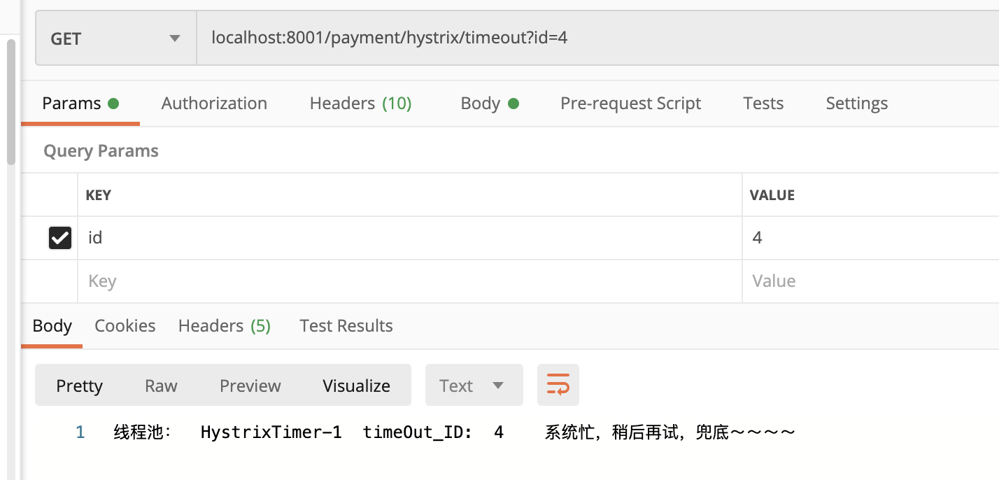

  3. 80fallback：**调用者客户端自己对自己的保护，调用的8001运行3秒时正常，但是客户端80自己觉得等1秒就已经不行了，自己1秒后就降级。**

     【现开启openfeign对hystrix的支持，修改properties】

     ```properties
     feign.hystrix.enabled=true
     ```

     主启动

     ```java
     @EnableHystrix
     ```

     controller

     ```java
      @GetMapping("/consumer/payment/hystrix/timeout")
         @HystrixCommand(fallbackMethod = "paymentInfo_timeOutHandler",commandProperties = {
                 @HystrixProperty( name = "execution.isolation.thread.timeoutInMilliseconds", value = "1000" )//1 秒 钟 以 内 就是正常的 业务逻辑      
         })
         public String paymentInfo_timeOut(@RequestParam("id") Integer id){
             String s = service.paymentinfo_timeOut(id);
             log.info("~~~~~~~~: "+s);
             return s;
         }
     
         public String paymentInfo_timeOutHandler(@RequestParam("id") Integer id){
             return "我是调用者80，支付系统繁忙，我不等了～～～～";
         }
     ```

     

     【注意】：如果80去调用8001，8001中出现了错误，类似10/0，80依然会降级

     **现在的问题，代码膨胀，耦合度高**：

     

     

     解决代码膨胀可以使用公共的兜底方法：

     ```java
     @DefaultProperties(defaultFallback = "")
     ```

     

     解决耦合度高可以使用在80端，service调用接口统一处理降级：

     在80调用接口上

     ```java
     @FeignClient(value = "SPRINGCLOUD-HYSTRIX-PAYMENT",fallback = PaymentHystrixServiceImpl.class)
     ```

     PaymentHystrixServiceImpl实现调用接口类，完成降级：

     ```java
     @Component
     public class PaymentHystrixServiceImpl implements PaymentHystrixService {
         @Override
         public String paymentinfo_OK(Integer id) {
             return "-----PaymentFallbackService fall back-paymentInfo_OK , (┬ ＿ ┬)";
         }
     
         @Override
         public String paymentinfo_timeOut(Integer id) {
             return "-----PaymentFallbackService fall back-paymentInfo_TimeOut , (┬ ＿ ┬)";
         }
     }
     ```

     在8001宕机的情况下80去调用就会降级：

     

     **此时服务端provider已经down了，但是我们做了服务降级处理，让客户端在服务端不可用时也会获得提示信息而不会挂起耗死服务器**

     

- **服务熔断**

  一句话：家里的保险丝，功率超过之后，跳闸，此时你会去关闭个大功率的家电，在把闸恢复；

  

  1. 实操：

     在hystrix8001service中添加熔断的方法

     ```java
       //==================服务熔断====================
         @HystrixCommand(fallbackMethod = "paymentCircuitBreaker_fallback", commandProperties = {
            @HystrixProperty(name = "circuitBreaker.enabled", value = "true"),   // 是否开启断路器
            @HystrixProperty(name = "circuitBreaker.requestVolumeThreshold", value = "10"),  //请求次数
            @HystrixProperty(name = "circuitBreaker.sleepWindowInMilliseconds", value = "10000"),//时间范围
            @HystrixProperty(name = "circuitBreaker.errorThresholdPercentage", value = "60"),  //失败率达到60后跳闸
         })
         public String paymentCircuitBreaker(@PathVariable("id") Integer id) {
             if (id < 0) {
                 throw new RuntimeException("*****id  不能负数 ");
             }
             String serialNumber = IdUtil.simpleUUID();
             return Thread.currentThread().getName() + " \t " + " 调用成功 , 流水号： " + serialNumber;
         }
     
         public String paymentCircuitBreaker_fallback(@PathVariable("id") Integer id) {
             return "id  不能负数，请稍候再试 ,(┬ ＿ ┬)/~~     id: " + id;
         }
     ```

     **:o:业务逻辑：传入id，当id为正数返回流水号；当id为负数抛出异常，抛出的异常会引发服务降级，调用兜底方法paymentCircuitBreaker_fallback，此时Hystrix不会一直让服务器降级，它回去判断严重程度，当10秒内，10个请求中错误了60%，就会熔断。即使后面来的是正数也会降级报错，直到慢慢的后来正确的值越来越多，才会慢慢的恢复链路；**

     通过controller调用，8001自测：

     **结论**：**一开始传入正数成功生成流水号，传入多次负数引发服务降级后，错误太多触发服务熔断，熔断后及时传入正确也会报错降级，过一段时间慢慢恢复；**

     

  2. 服务熔断总结

     

     

     

     断路器在什么情况才会熔断：

     

     断路器打开后：

     

     所有配置：

     

- 服务限流：后面再说

  ​	

## 4、Hystrix工作流程

[Hystrix工作官网](https://github.com/Netflix/Hystrix/wiki/How-it-Works)


**1、构造HystrixCommand或HystrixObservableCommand对象**
 创建代码如下

```bash
HystrixCommand command = new HystrixCommand(arg1, arg2); 
HystrixObservableCommand command = new HystrixObservableCommand(arg1, arg2);
```

**2、执行Command 命令**

共有4种执行命令的方法，前2种只支持HystrixCommand ，后2种只支持HystrixObservableCommand

- execute(): 同步阻塞直至从依赖服务返回结果或抛出异常
- queue(): 异步模式，返回Future，Future封装返回的内容
- observe() : 直接订阅Observable ，此对象包含了从依赖服务返回的结果
- toObservable() : 返回Observable 对象，当你订阅他时，它会执行Hystrix命令并返回结果

HystrixCommand.execute(): 实际调用queue()的方法

```cpp
public R execute() {
   return queue().get();
}
```

HystrixCommand.queue(): 实际调用toObservable()的方法

```csharp
 public Future<R> queue() {
     final Future<R> delegate = toObservable().toBlocking().toFuture();
      ....
 }
```

HystrixObservableCommand.observe():实际调用toObservable()的方法

```java
public Observable<R> observe() {
....
    final Subscription sourceSubscription = toObservable().subscribe(subject);
....
```

通过以上的代码，我们可以知道：第1种是同步阻塞性调用，第2种是异步非阻塞性调用，第3、4种是基于发布-订阅响应式的调用。虽然是4种调用方式，其实际最后都是基于toObservable方法来实现的

**3、判断结束是否有缓存**
 如果请求缓存功能开启，并且请求在缓存命中，那么返回一个Observable，此对象包含请求的结束

**4、判断短路器是否开启**
在执行命令时，Hystrix 如果发现断路器跳闸，那么hystix会跳到步骤8去执行回退(fallback)逻辑。如果断路器没有跳闸，则继续执行步骤5关于断路器打开和关闭的条件见本文的下方。

**5、判断线程池/队列/信号资源是否满了**
 如果命令关联的线程池和队列（或信号量）满了，则不会执行命令，会跳到步骤8去执行回退(fallback)逻辑

**6、执行HystrixObservableCommand.construct()或HystrixCommand.run()**

执行HystrixCommand.run()或HystrixObservableCommand.construct()时，如果执行超时或者执行失败，则执行会跳到步骤8去执行回退(fallback)逻辑；如果正常结束，Hystrix 会记录一些日志和监控数据，并返回处理结果

**7、Calculate Circuit Health**
 Hystrix向断路器报告成功、失败、拒绝和超时。断路器维护一组计数器来统计执行数据。

**8、获取 Fallback逻辑**
 当发生如下情况时，Hystrix会尝试执行回退(fallback)逻辑：

- **在执行时construct() or run() ，跑出异常 (发生在步骤6.)**
- **断路器打开时，命令被断路 (发生在步骤4.)**
- **当执行命令时，依赖的线程池、队列或信号量满(发生在步骤5.)**
- **执行命令超时**

编写回退(fallback)逻辑时，这个逻辑里最好没有网络调用，只从内存中获取或者只有静态的逻辑，这个逻辑保证不会执行失败。如果非要通过网络去获取Fallback,你需要在使用其他HystrixCommand或HystrixObservableCommand封装请求，并且这个请求必须有fallback逻辑且值没有网络调用，只有静态逻辑

**9、Return the Successful Response**
 返回执行结束或者Observable

作者：沉沦2014
链接：https://www.jianshu.com/p/4ea5efc9351e
来源：简书


## 5、服务监控HystrixDashboard

- **新建springcloud-hystrix-dashboard9001**

- **Pom**

  ```xml
         <dependency>
              <groupId>org.springframework.cloud</groupId>
              <artifactId>spring-cloud-starter-netflix-hystrix-dashboard</artifactId>
          </dependency>
  ```

- **Properties**

- **主启动新注解**

  ```java
  @EnableHystrixDashboard
  ```

- **被监控的微服务提供者需要添加依赖**

  ```xml
          <dependency>
              <groupId>org.springframework.boot</groupId>
              <artifactId>spring-boot-starter-actuator</artifactId>
          </dependency>
  ```

- 启动9001:localhost:9001/hystrix

  

  springcloud升级后有个bug需要在服务提供者主启动加入：

  ```java
   /**
       *此配置是为了服务监控而配置，与服务容错本身无关，springcloud升级后的坑
       *ServletRegistrationBean因为springboot的默认路径不是"/hystrix.stream"，
       *只要在自己的项目里配置上下面的servlet就可以了
       */
      @Bean
      public ServletRegistrationBean getServlet() {
          HystrixMetricsStreamServlet streamServlet = new HystrixMetricsStreamServlet();
          ServletRegistrationBean registrationBean = new ServletRegistrationBean(streamServlet);
          registrationBean.setLoadOnStartup(1);
          registrationBean.addUrlMappings("/hystrix.stream");
          registrationBean.setName("HystrixMetricsStreamServlet");
          return registrationBean;
      }
  ```

  启动7001、7002、hystrix8001查看监控：

  都传正确时候：13个请求，断路器现实closed（保险丝处于关闭）

  

  都传错误：错误率100%，断路器打开

  

  

# 十一、Gateway新一代网关

## 1、概述介绍

- [上一代zuul 1.X](https://github.com/Netflix/zuul/wiki)

- [当前gateway](https://cloud.spring.io/spring-cloud-static/spring-cloud-gateway/2.2.1.RELEASE/reference/html/)

- **是什么：**

  

  一句话：Spring Cloud Gateway 使用的Webflux中的reactor-netty响应式编程组件，底层使用了Netty通讯框架

- **能干嘛**

  

  	

- **为什么要选Gateway**

  

  

  

- **Gateway与Zuul的区别**

  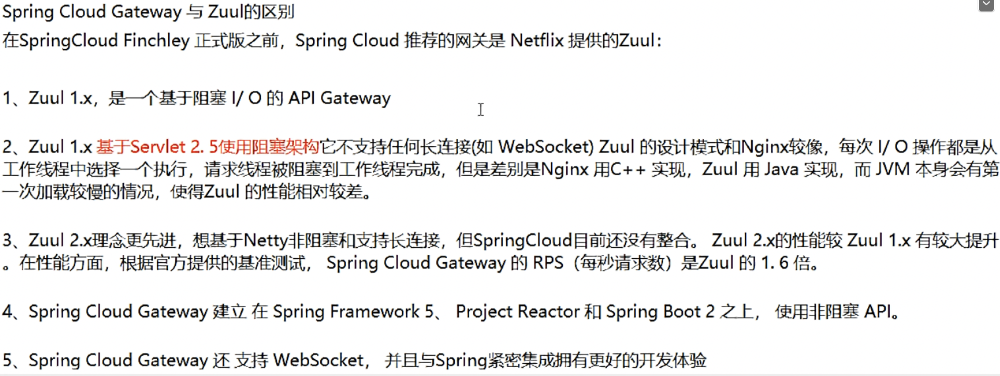

- **Gateway模型**

  

## 2、三大核心概念

- **路由（Route）**

  路由是构建网关的基本模块，它由ID，目标URI，一系列的断言和过滤器组成，如果断言为true则匹配该路由

- **断言（Predicate）**

  参考的是java8的java.util.function.Predicate开发人员可以匹配HTTP请求中的所有内容（例如请求头或请求参数），如果请求与断言相匹配则进行路由

- **过滤（Filter）**

  指的是Spring框架中GatewayFilter的实例，使用过滤器，可以在请求被路由前或者之后对请求进行修改。


## 3、Gateway工作流程


**核心逻辑：路由转发+执行过滤链**

## 4、入门配置

- 新建spring cloud-gateway9527

- pom

  ```xml
  <dependency>
              <groupId>org.springframework.cloud</groupId>
              <artifactId>spring-cloud-starter-gateway</artifactId>
          </dependency>
  ```

  此依赖不能和springboot-start-web一起使用否则会出错❌

- yml

  ```yml
  
  server:
    port: 9527
  
  spring:
    application:
      name: spirngcloud-gateway
    cloud:
      gateway:
        discovery:
          locator:
            enabled: true #开启从注册中心动态创建路由的功能，利用微服务名进行路由
        routes:
          - id: payment_routh #payment_route    #路由的ID，没有固定规则但要求唯一，建议配合服务名
            uri: http://localhost:8001          #匹配后提供服务的路由地址
            #uri: lb://cloud-payment-service #匹配后提供服务的路由地址
            predicates:
              - Path=/getpayment         # 断言，路径相匹配的进行路由
  
          - id: payment_routh2 #payment_route    #路由的ID，没有固定规则但要求唯一，建议配合服务名
            uri: http://localhost:8001          #匹配后提供服务的路由地址
            #uri: lb://cloud-payment-service #匹配后提供服务的路由地址
            predicates:
              - Path=/payment/lb        # 断言，路径相匹配的进行路由
              #- After=2020-02-21T15:51:37.485+08:00[Asia/Shanghai]
              #- Cookie=username,zzyy
              #- Header=X-Request-Id, \d+  # 请求头要有X-Request-Id属性并且值为整数的正则表达式
  
  eureka:
    instance:
      hostname: cloud-gateway-service
    client: #服务提供者provider注册进eureka服务列表内
      service-url:
        register-with-eureka: true
        fetch-registry: true
        defaultZone: http://eureka7001.com:7001/eureka
  ```

- 主启动：

  ```java
  @SpringBootApplication
  @EnableEurekaClient
  ```

- 测试

  启动7001、7002、8002、8002、9527

  访问 localhost:9527/getpayment?id=1   localhost:9527/payment/lb

- 还可以配置bean跳转到其他页面

  ```java
  @Configuration
  public class GatewayConfig {
      @Bean
      public RouteLocator customRouteLocator(RouteLocatorBuilder routeLocatorBuilder){
          RouteLocatorBuilder.Builder routes=routeLocatorBuilder.routes();
          routes.route("path_route_zyq",(r) -> r.path("/guonei").uri("http://news.baidu.com/guonei")).build();
          return routes.build();
  
      }
  }
  ```

  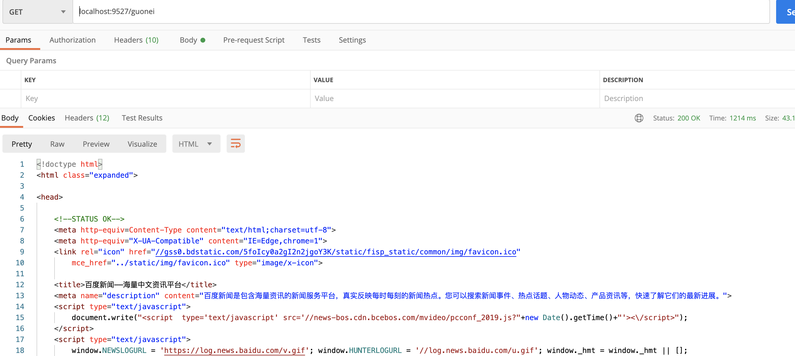

【利用bean或者properties都可以配置路由和断言，选什么就看自己】

## 5、通过微服务名实现动态路由

- 以上我们都是写死路由转发地址8001，实际一个微服务名下有多个微服务实现负载均衡

- 先配置

  

- 再配置

  

- 测试，可以实现路由转发负载均衡

  **

## 6、Predicate（断言）的使用

**目的：为了更加精准的匹配，判断来的请求是否满足要有满足才进行路由转发**

Eg:


- **After Route Predicate**

  在该时间之后请求才有效，才能路由转发

    \- After=2020-03-08T10:59:34.102+08:00[Asia/Shanghai]

- **Before Route Predicate**

  在该时间之前请求有效，才能路由转发

    \- Before=2020-03-08T10:59:34.102+08:00[Asia/Shanghai]

- **Cookie Route Predicate**

  请求中需要带着配置的cokkie，才能路由转发

  

  Eg: 

  ```xml
  - Cookie=username,zzyy
  ```

  请求中需要带着名字为username的cookie，值为zzyy

  

- **Header Route Predicate**

  

  eg：请求头需要带着X-Request-Id，值为正数

  ```
  - Header=X-Request-Id, \d+
  ```

  

……

- **总结**

  **说白了，Predicate就是为了实现一组匹配规则，让请求过来找到对应的Route进行处理**

  eg：

  

  **解释: 在cloud-payment-service微服务下需要满足，有/payment/lb这么一个请求路径的controller，需要在2020年2月21号后请求才有效，cokkie要带着username值为zzyy，请求头……等断言要求满足；才会转发去访问cloud-payment-service下的/payment/lb方法**

## 7、Filter的使用


Filter是挡在微服务前的屏障，可以对请求做一些操作，阻挡或者放行；

- **自定义Filter**

  ```java
  @Component
  public class MyLogGateWayFilter implements GlobalFilter, Ordered {
  
      @Override
      public Mono<Void> filter(ServerWebExchange exchange, GatewayFilterChain chain) {
          String uname = exchange.getRequest().getQueryParams().getFirst("uname");
          if (uname == null) {
              System.out.println("uname为空，非法");
              exchange.getResponse().setStatusCode(HttpStatus.NOT_ACCEPTABLE);
              return exchange.getResponse().setComplete();
          }
          return chain.filter(exchange);
      }
  
  
      @Override
      public int getOrder() {
          return 0;
      }
  }
  
  ```

  判断请求是否带参数“uname”，带了就放行

  

  

# 十二、SpringCloud Config分布式配置中心

## 1、概述

- **现在分布式系统面临的配置问题：**

​	微服务意味着将单体应用拆分成一个个的子服务，每个服务颗粒度较小，因此系统会出现大量的微服务，由于每一个微服务都需要有自己的配置文件才能运行，就可能出现上百个application.properties的情况，是很痛苦的，所以一套集中式的、动态的配置管理设施就必不可少；

- **是什么**

  

- **能干嘛**

  

- **与Github整合配置**

  由于SpringCloud Config默认使用Git来存储配置文件（也有其它方式，比如支持svn和本地文件，但最推荐的还是Git，而且使用的是http/https访问的形式）

- **官网**

  [官网](https://cloud.spring.io/spring-cloud-static/spring-cloud-config/2.2.1.RELEASE/reference/html/)

## 2、Config服务端配置与测试

- 新建项目SpringCloud-Config3344

- pom

  ```xml
    <dependency>
              <groupId>org.springframework.cloud</groupId>
              <artifactId>spring-cloud-config-server</artifactId>
          </dependency>
          <dependency>
              <groupId>org.springframework.cloud</groupId>
              <artifactId>spring-cloud-starter-netflix-eureka-client</artifactId>
          </dependency>
  ```

- yml

  ```yml
  server:
    port: 3344
  
  spring:
    application:
      name:  springcloud-config-center #注册进Eureka服务器的微服务名
    cloud:
      config:
        server:
          git:
            uri: https://github.com/839565099/SpringCloud-config.git #GitHub上面的git仓库名字
            ####搜索目录
            search-paths:
              - SpringCloud-config
        ####读取分支
        label: master
  
  #服务注册到eureka地址
  eureka:
    client:
      service-url:
        defaultZone: http://localhost:7001/eureka,http://localhost:7002/eureka
  ```

  配置中心远程地址：自己在githug上建一个仓库，然后使用这个仓库https://github.com/839565099/SpringCloud-config.git

  

  

  里面自己配置一个config-dev.properties文件

- 主启动

  ```java
  @EnableConfigServer
  ```

- 测试：去读取github上的配置文件

  启动7001、7002、3344

  访问：localhost:3344/master/config-dev.yml,可以读取到文件内容

- 读取规则

  

  

  Eg

## 3、Config客户端配置与测试

- 新建springcloud-config-client3355

- pom

  ```xml
   <dependency>
              <groupId>org.springframework.cloud</groupId>
              <artifactId>spring-cloud-starter-config</artifactId>
          </dependency>
          <dependency>
              <groupId>org.springframework.cloud</groupId>
              <artifactId>spring-cloud-starter-netflix-eureka-client</artifactId>
          </dependency>
  ```

- bootstrap.yml

  ```yml
  server:
    port: 3355
  
  spring:
    application:
      name: config-client
    cloud:
      #Config客户端配置
      config:
        label: master #分支名称
        name: config #配置文件名称
        profile: dev #读取后缀名称   上述3个综合：master分支上config-dev.yml的配置文件被读取http://config-3344.com:3344/master/config-dev.yml
        uri: http://localhost:3344/ #配置中心地址k
        discovery:
          enabled: true
          service-id: springcloud-config-center
  
  #服务注册到eureka地址
  eureka:
    client:
      service-url:
        defaultZone: http://localhost:7001/eureka,http://localhost:7001/eureka
  
  
  ```

- 主启动

  ```java
  @EnableEurekaClient
  ```

- controller

  ```java
  @RestController
  @RefreshScope
  public class ConfigClientController {
  
      @Value("${config.info}")
      private String configInfo;
  
      @GetMapping("/configInfo")
      public String getConfigInfo() {
          return configInfo;
      }
  }	
  ```

- 测试：访问localhost:3355/configInfo

  可以访问到3344从github上获取到配置信息

- 现在存在问题：修改github上配置文件后，3344也跟着修改了，但是3355没有修改，需要每次重启

## 4、Config客户端动态刷新

1. **手动版的刷新**

   - 修改3355，引入依赖

     ```xml
       <dependency>
                 <groupId>org.springframework.boot</groupId>
                 <artifactId>spring-boot-starter-actuator</artifactId>
             </dependency>
     ```

   - 暴露监控端点

     ```yml
     #爆露监控端
     management:
       endpoints:
         web:
           exposure:
             include: "*"
     ```

   - 在controller加上注解

     ```java
     @RefreshScope
     ```

   - 修改GitHub上的配置文件后，3344直接自己改了，此时还需要向3355发送一个post请求，之后就生效了,避免了重启3355

     ```http
     http://localhost:3355/actuator/refresh
     ```

2. **还有问题？此时手动刷新可以，但是如果有很多个3355类似微服务，个个都要去发post**

   此时就引入了下一个技术：**消息总线**

# 十三、SpringCloud Bus消息总线

## 1、概述

分布式自动刷新配置功能

Spring Cloud Bus配合Spring Cloud Config使用可以实现配置的动态刷新

- 是什么

  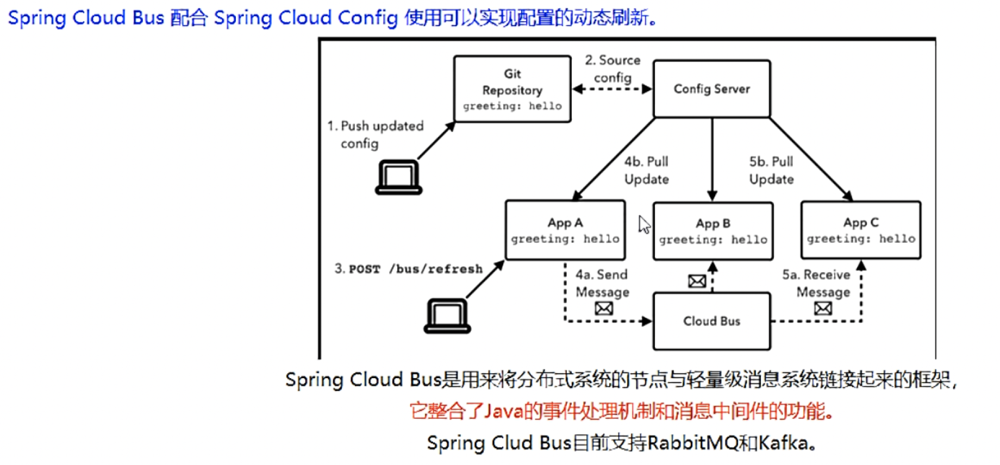

- 能干嘛

  SpringCloud Bus能管理和传播分布式系统间的消息，就像一个分布式的执行器，可用于广播更改，事件推送，也可以当作微服务的消息通道

  

- 为何被称为总线

  

## 2、安装RabbitMQ

- **Bus支持两种消息代理：RabbitMQ和Kafka**
- 此处我使用docker安装RabbitMQ
- 并且能访问操作台
- 

## 3、SpringCloud Bus动态刷新全局广播

​		相当于MQ的topic模式订阅模式

- 演示广播效果，增加复杂度，再以3355为模板再制作一个3366

- 3366和3355一样在github修改配置文件后，只有3344配置中心能获取新的配置数据，或者需要一个一个发送post请求刷新；

- 此时利用Bus总线就可以做到自己刷新所有连接着3344的微服务

- 方式一：**利用消息总线触发一个客户端/bus/refresh,而刷新所有客户端的配置**

  

- 方式二：**利用消息总线触发一个服务端ConfigServer的/bus/refresh端点,而刷新所有客户端的配置（更加推荐）**

  

​       方式二相当于直接bus总结刷新ConfigServer（3344）给3344发送一次post刷新请求，就可以刷新连接着3344的微服务；			

- 在ConfigServer（3344）和所有连接着配置中心的微服务（3355、3366……）都加上依赖

  ```xml
   <dependencies>
          <!--添加消息总线RabbitMQ支持-->
          <dependency>
              <groupId>org.springframework.cloud</groupId>
              <artifactId>spring-cloud-starter-bus-amqp</artifactId>
          </dependency>
         <!--3344添加配置中心，下面依赖选其一即可-->
          <dependency>
              <groupId>org.springframework.cloud</groupId>
              <artifactId>spring-cloud-config-server</artifactId>
          </dependency>
          <!--连接3344的微服务添加配置client-->
           <dependency>
              <groupId>org.springframework.cloud</groupId>
              <artifactId>spring-cloud-starter-config</artifactId>
          </dependency>
          <dependency>
              <groupId>org.springframework.cloud</groupId>
              <artifactId>spring-cloud-starter-netflix-eureka-client</artifactId>
          </dependency>
          <dependency>
              <groupId>org.springframework.boot</groupId>
              <artifactId>spring-boot-starter-web</artifactId>
          </dependency>
  
          <dependency>
              <groupId>org.springframework.boot</groupId>
              <artifactId>spring-boot-starter-actuator</artifactId>
          </dependency>
          <dependency>
              <groupId>org.springframework.boot</groupId>
              <artifactId>spring-boot-devtools</artifactId>
              <scope>runtime</scope>
              <optional>true</optional>
          </dependency>
          <dependency>
              <groupId>org.projectlombok</groupId>
              <artifactId>lombok</artifactId>
              <optional>true</optional>
          </dependency>
          <dependency>
              <groupId>org.springframework.boot</groupId>
              <artifactId>spring-boot-starter-test</artifactId>
              <scope>test</scope>
          </dependency>
      </dependencies>
  ```

- 配置中心yml

  ```yml
  server:
    port: 3344
  
  spring:
    application:
      name:  springcloud-config-center #\u6CE8\u518C\u8FDBEureka\u670D\u52A1\u5668\u7684\u5FAE\u670D\u52A1\u540D
    cloud:
      config:
        server:
          git:
            uri: https://github.com/839565099/SpringCloud-config.git #GitHub\u4E0A\u9762\u7684git\u4ED3\u5E93\u540D\u5B57
            ####\u641C\u7D22\u76EE\u5F55
            search-paths:
              - SpringCloud-config
        ####\u8BFB\u53D6\u5206\u652F
        label: master
  
  
    #rabbitmq相关配置 15672是Web管理界面的端口；5672是MQ访问的端口
    rabbitmq:
      host: 192.168.174.131
      port: 5672
      username: guest
      password: guest
  
  #\u670D\u52A1\u6CE8\u518C\u5230eureka\u5730\u5740
  eureka:
    client:
      service-url:
        defaultZone: http://localhost:7001/eureka,http://localhost:7002/eureka
  
  management:
    endpoints:
      web:
        exposure:
          include: 'bus-refresh'
  ```

- 连接配置中心微服务yml

  ```yml
  server:
    port: 3366
  
  spring:
    application:
      name: config-client
    cloud:
      #Config客户端配置
      config:
        label: master #分支名称
        name: config #配置文件名称
        profile: dev #读取后缀名称   上述3个综合：master分支上config-dev.yml的配置文件被读取http://config-3344.com:3344/master/config-dev.yml
        uri: http://localhost:3344 #配置中心地址
  
  #rabbitmq相关配置 15672是Web管理界面的端口；5672是MQ访问的端口
    rabbitmq:
      host: 192.168.174.131
      port: 5672
      username: guest
      password: guest
  
  #服务注册到eureka地址
  eureka:
    client:
      service-url:
        defaultZone: http://localhost:7001/eureka,http://localhost:7002/eureka
  
  # 暴露监控端点
  management:
    endpoints:
      web:
        exposure:
          include: "*"
  
  ```

- 测试：启动7001、7002、3344、3355、3366

  修改GitHub配置文件

  只需要在3344配置中心发送一次post刷新请求，即可刷新全部连着配置中心的微服务；

  ```http
  http://localhost:3344/actuator/bus-refresh
  ```

  之后3355、3366全部刷新

  

- **总结：一次修改，广播通知，处处修改**

## 4、SpringCloud Bus动态刷新定点通知

- 场景：不想全部通知，只想定点通知，只通知3355、不想通知3366

- 简单一句话：指定具体某一个实例生效而不是全部

- **公式：http://localhost:配置中心的端口号/actuator/bus-refresh/{destination}**

  {destination}:对应**application.name:server.port**

  

- eg：修改3355，不修改3366，给3344发送post刷新请求，请求如下：

  ```http
  http://localhost:3344/actuator/bus-refresh/config-client:3355
  ```

#  十四、SpringCloud Stream消息驱动

## 1、消息驱动概述

- **是什么**

  

  **一句话：屏蔽底层消息中间件的差异，降低切换版本，统一消息的编程模型**

  [官网](https://cloud.spring.io/spring-cloud-static/spring-cloud-stream/3.0.1.RELEASE/reference/html/)

  [中文文档](https://m.wang1314.com/doc/webapp/topic/20971999.html)

- **设计思路**

  1. 标准MQ

     

  2. 为什么使用stream

     

     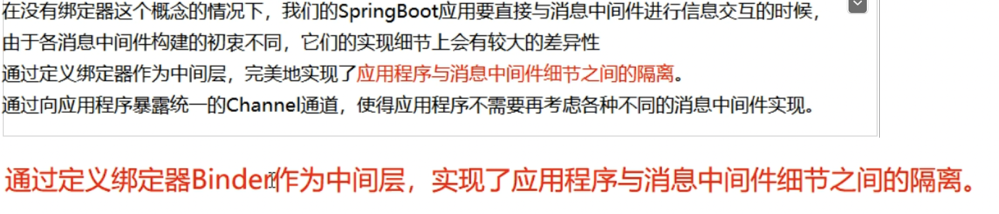

     

     stream中的消息通信遵循啦发布-订阅模式，Topic主题进行广播

  3. SpringCloud Stream标准流程套路

     

## 2、案例说明

- RabbitMQ环境OK
- 

## 3、消息驱动之生产者

- 新建springcloud-stream-rabbitmq8801

- pom

  ```xml
          <dependency>
              <groupId>org.springframework.boot</groupId>
              <artifactId>spring-boot-starter-web</artifactId>
          </dependency>
          <dependency>
              <groupId>org.springframework.boot</groupId>
              <artifactId>spring-boot-starter-actuator</artifactId>
          </dependency>
          <dependency>
              <groupId>org.springframework.cloud</groupId>
              <artifactId>spring-cloud-starter-netflix-eureka-client</artifactId>
          </dependency>
          <dependency>
              <groupId>org.springframework.cloud</groupId>
              <artifactId>spring-cloud-starter-stream-rabbit</artifactId>
          </dependency>
  ```

- yml

  ```yml
  server:
    port: 8801
  
  spring:
    application:
      name: springcloud-stream-provider
    cloud:
        stream:
          binders: # 在此处配置要绑定的rabbitmq的服务信息；
            defaultRabbit: # 表示定义的名称，用于于binding整合
              type: rabbit # 消息组件类型
              environment: # 设置rabbitmq的相关的环境配置
                spring:
                  rabbitmq:
                    host: 192.168.174.131
                    port: 5672
                    username: guest
                    password: guest
          bindings: # 服务的整合处理
            output: # 这个名字是一个通道的名称
              destination: studyExchange # 表示要使用的Exchange名称定义
              content-type: application/json # 设置消息类型，本次为json，文本则设置“text/plain”
              binder: defaultRabbit # 设置要绑定的消息服务的具体设置
  
  eureka:
    client: # 客户端进行Eureka注册的配置
      service-url:
        defaultZone: http://localhost:7001/eureka,http://localhost:7002/eureka
    instance:
      lease-renewal-interval-in-seconds: 2 # 设置心跳的时间间隔（默认是30秒）
      lease-expiration-duration-in-seconds: 5 # 如果现在超过了5秒的间隔（默认是90秒）
      instance-id: send-8801.com  # 在信息列表时显示主机名称
      prefer-ip-address: true     # 访问的路径变为IP地址
  ```

- service接口

  ```java
  public interface IMessageProvider {
      public String send();
  }
  ```

- 实现类：

  ```java
  import com.zyq.service.IMessageProvider;
  import lombok.extern.slf4j.Slf4j;
  import org.springframework.cloud.stream.annotation.EnableBinding;
  import org.springframework.cloud.stream.messaging.Source;
  import org.springframework.messaging.MessageChannel;
  import org.springframework.messaging.support.MessageBuilder;
  
  import javax.annotation.Resource;
  import java.util.UUID;
  
  
  @EnableBinding(Source.class)//定义消息打推送管道
  @Slf4j
  public class IMessageProviderImpl implements IMessageProvider {
      @Resource
      private MessageChannel output;//消息发送通道
  
      @Override
      public String send() {
          String s = UUID.randomUUID().toString();
          boolean send = output.send(MessageBuilder.withPayload(s).build());
          log.info("~~~~~~~: " + send);
          return null;
      }
  }
  ```

- controller

  ```java
  @RestController
  @Slf4j
  public class SendMessageController {
      @Resource
      private IMessageProvider iMessageProvider;
      @GetMapping(value = "/sendMessage")
      public String send(){
          return iMessageProvider.send();
      }
  
  }
  ```

- 测试访问

  ```http
  localhost:8801/sendMessage
  ```

## 3、消息驱动之消费者

- 新建spring cloud-stream-rabbitmq-consumer8802

- pom和8801相同

- yml：bindings改为input

  

- controller

  ```java
  import lombok.extern.slf4j.Slf4j;
  import org.springframework.beans.factory.annotation.Value;
  import org.springframework.cloud.stream.annotation.EnableBinding;
  import org.springframework.cloud.stream.annotation.StreamListener;
  import org.springframework.cloud.stream.messaging.Sink;
  import org.springframework.messaging.Message;
  import org.springframework.web.bind.annotation.RestController;
  
  @RestController
  @Slf4j
  @EnableBinding(Sink.class)
  public class ReceiveMessageListenerController {
      @Value("${server.port}")
      private String  port;
      @StreamListener(Sink.INPUT)
      public void getInput(Message<String> message){
          log.info("接收消息～～～～："+message.getPayload()+" port:"+port);
      }
  }
  ```

- 测试 8801发送消息、8802接受消息

  

## 4、分组消费与持久化

- 依照8802再新建8803：此时就存在8801生产者和8802、8803消费者

- 存在问题：当8801发送消息，8802、8803同时接受到了消息；这就是**重复消费的问题**

  ​				**原因：stream自动给8802、8803分配了不同的流水号，在不同的组。微服务应用放置于同一个group中，就能够保证消息只会被其中一个应用消费一次。不同的组是可以消费的，同一个组内会发生竞争关系，只有其中一个可以消费。**

  

- **分组**

  8802、8803都分配相同的组：zyqA

  

此时8801发送消息，同一组内的8802、8803会轮询接受消息

- **持久化**

  当分过组的微服务，例如：zyqA组。该微服务自然就有了持久化；

  当该微服务断连时候，如果生产者发送了消息，此时该有持久化的消费者上线，会自动接受错过的消息；
  
  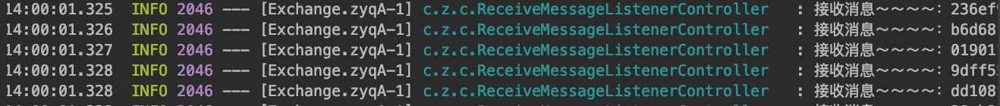

# 十五、SpringCloud Sleuth分布式请求链路追踪

## 1、概述

**现在微服务系统存在的问题：**

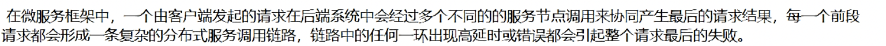

- **是什么**

  Spring Cloud Sleuth提供了一套完整的服务跟踪的解决方案；Sleuth收集数据，Zipkin提供展示平台

## 2、搭建链路监控

- Zipkin 

  利用docker安装zipkin

  ```she l
  docker run -d --restart always -p 9411:9411 --name zipkin openzipkin/zipkin 
  ```

  能访问：http://ip:9411/zipkin/

- 


